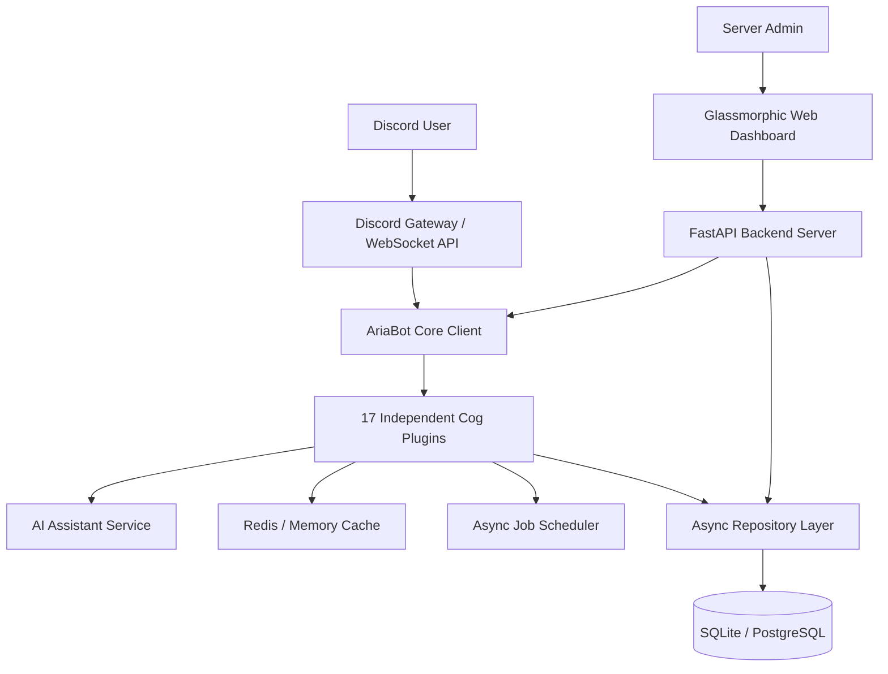

# 🤖 Aria — Official AI Discord Bot & Community Platform

<p align="center">
  
</p>

<p align="center">
  
  
  
  
  
  
</p>

**Aria** is an enterprise-grade, modern, fully asynchronous, modular AI-powered Discord assistant and Web Management Platform built for community management, AI software engineering assistance, support tickets, leveling, economy, and server security for the **OpenDroid Community**.

---

## 🌟 Executive Summary & Key Highlights

Aria replaces fragmented, single-purpose Discord bots (such as MEE6, Carl-bot, Dyno, and Ticket Tool) with a unified, self-hostable architecture engineered for high concurrency and zero-downtime plugin hot-reloading.

### Key Highlights:
- **Multi-Provider AI Architecture**: Seamlessly stream responses from OpenAI, Anthropic Claude, Google Gemini, Groq, OpenRouter, or local LLMs (Ollama & LM Studio).
- **Security-First Onboarding**: Protect servers against raid bots and alt accounts using Pillow-generated image Captchas.
- **Enterprise Support Tickets**: Full lifecycle ticket channels with interactive buttons, staff assignment, ratings, and self-contained HTML transcript generation.
- **Async Database & Cache**: Type-safe repository pattern over SQLAlchemy 2.0 with Redis caching and graceful in-memory fallbacks.
- **Modern Web Control Panel**: Glassmorphic FastAPI dashboard for live server metrics, module controls, and real-time log streaming.

---

## 🏗️ Architecture Overview



---

## 🧩 Feature Modules & Capabilities

| Module | Location | Key Functionality |
|---|---|---|
| **AI Assistant** | `cogs/ai` | Multi-provider streaming, code review, debugging, translation, topic auto-detection, provider/model toggling. |
| **Moderation** | `cogs/moderation` | AutoMod (links, bad words, mass mentions), warnings, timeouts, kicks, softbans, bans, cases history, mod notes, appeals. |
| **Welcome** | `cogs/welcome` | Animated welcome embeds, goodbye messages, auto-roles, DM welcome messages. |
| **Verification** | `cogs/verification` | Pillow image Captcha verification panel and verified role assignment. |
| **Tickets** | `cogs/tickets` | Category dropdowns, claim ticket, member add/remove, HTML transcript exporter, feedback rating modal. |
| **Reaction Roles** | `cogs/roles` | Dropdown role selectors and interactive toggle buttons. |
| **Polls** | `cogs/polls` | Interactive voting buttons with live vote counts and percentages. |
| **Suggestions** | `cogs/suggestions` | Upvoting/downvoting, staff status reviews (Pending, Approved, Implemented). |
| **Leveling** | `cogs/leveling` | Message & voice XP tracking, rank cards, leaderboards, and Prestige ranks. |
| **Economy** | `cogs/economy` | Wallet/bank balance, daily rewards, P2P coin transfers, shop catalog, inventory, coin flip game. |
| **Reminders** | `cogs/reminders` | Scheduled DM reminders via async background scheduler loop. |
| **Community** | `cogs/community` | Community FAQ knowledge base search, official announcement embeds. |
| **Utility** | `cogs/utility` | Help directory, latency check, system stats, userinfo, serverinfo. |
| **Fun** | `cogs/fun` | Magic 8-ball, dice rolling, programming jokes, technology facts. |
| **Analytics** | `cogs/analytics` | Real-time member counts, channel metrics, and system status overview. |
| **Audit Logging**| `cogs/logging` | Listeners for deleted/edited messages, nickname changes, and join/leave events. |
| **Owner Panel** | `cogs/owner` | Dynamic cog hot-reloading, maintenance mode, system broadcasts, cache clearing, health metrics. |

---

## 📁 Detailed Project Directory Hierarchy

```
ariabot/
├── .github/
│   └── workflows/
│       └── ci.yml                # Automated GitHub Actions CI workflow (Ruff, Pytest)
├── assets/                       # Project logos, graphics, and static media
├── bot/
│   ├── client.py                 # Main AriaBot class subclassing commands.Bot
│   ├── main.py                   # CLI entry point to launch the bot
│   ├── config/
│   │   └── settings.py           # Pydantic Settings environment configuration
│   ├── database/
│   │   ├── connection.py         # Async SQLAlchemy engine & session factory
│   │   ├── models/               # SQLAlchemy ORM Data Models (Guild, User, Mod, Ticket, etc.)
│   │   └── repositories/         # Type-safe Repository Layer (CRUD abstraction)
│   ├── services/                 # Decoupled Core Services (AI, Cache, Captcha, Transcript, Scheduler)
│   ├── views/                    # Discord UI Components (Buttons, Dropdowns, Modals, Pagination)
│   ├── utils/                    # Structured Logger and formatting helpers
│   └── cogs/                     # 17 Feature Plugin Modules
├── dashboard/
│   ├── app.py                    # FastAPI Backend Application entry point
│   ├── auth.py                   # Discord OAuth2 Authentication module
│   ├── api/                      # REST API Endpoints (Stats, Settings, Logs)
│   └── static/                   # Glassmorphic Frontend (HTML, CSS, JS)
├── docs/
│   ├── USAGE.md                  # Comprehensive Operational Guide, PRD, and TRD
│   ├── COMMANDS.md               # Complete Slash Command Specification Table
│   ├── ARCHITECTURE.md           # Technical Architecture & Systems Diagram
│   └── DEPLOYMENT.md             # Production Deployment Guide (Docker, VPS, Cloud)
├── tests/                        # Pytest Test Suite (AI, Repositories, Economy, Bot Init)
├── Dockerfile                    # Multi-stage production container build
├── docker-compose.yml            # Multi-container orchestration (PostgreSQL + Redis + Bot + Dashboard)
├── pyproject.toml                # Black, Ruff, MyPy, and Pytest configuration
├── pytest.ini                    # Pytest environment flags
├── requirements.txt              # Production dependencies
└── README.md                     # Project README
```

---

## ⚙️ Environment Variables Matrix

Copy `.env.example` to `.env` and configure the following variables:

| Variable | Type | Default | Description |
|---|---|---|---|
| `DISCORD_TOKEN` | `str` | *Required* | Discord Bot Authentication Token from Developer Portal. |
| `DISCORD_CLIENT_ID` | `int` | `0` | Discord Application Client ID. |
| `DISCORD_GUILD_ID` | `int` | `None` | (Optional) Specific Guild ID for instant slash command sync. |
| `DATABASE_URL` | `str` | `sqlite+aiosqlite:///aria.db` | SQLAlchemy Database Connection URL. |
| `REDIS_URL` | `str` | `None` | Redis Connection URL (falls back to memory if empty). |
| `DEFAULT_AI_PROVIDER` | `str` | `openai` | Default AI provider (`openai`, `anthropic`, `groq`, `ollama`). |
| `DEFAULT_AI_MODEL` | `str` | `gpt-4o-mini` | Default AI model name. |
| `OPENAI_API_KEY` | `str` | `None` | OpenAI API Key. |
| `ANTHROPIC_API_KEY` | `str` | `None` | Anthropic Claude API Key. |
| `GROQ_API_KEY` | `str` | `None` | Groq High-Speed LLM API Key. |
| `OLLAMA_BASE_URL` | `str` | `http://localhost:11434` | Ollama local endpoint URL. |
| `DASHBOARD_PORT` | `int` | `8000` | FastAPI Web Dashboard HTTP Port. |
| `OWNER_IDS` | `list[int]` | `[]` | List of Discord User IDs with Owner Panel access. |

---

## ⚡ Local Setup & Execution Guide

### 1. Prerequisites
- Python 3.12 or higher
- Git

### 2. Setup Virtual Environment
```bash
# Clone repository
git clone https://github.com/opendroid/ariabot.git
cd ariabot

# Create and activate virtual environment
python3.12 -m venv venv
source venv/bin/activate  # On Windows: venv\Scripts\activate

# Install dependencies
pip install -r requirements.txt
```

### 3. Launch Bot & Web Dashboard
```bash
# Run the Discord Bot
python bot/main.py

# In a separate terminal, launch Web Dashboard
uvicorn dashboard.app:app --host 0.0.0.0 --port 8000 --reload
```
Open your browser and navigate to `http://localhost:8000` to view the Live Control Panel.

---

## 🐳 Docker Stack Deployment

Launch the full production stack containing PostgreSQL, Redis, Aria Bot, and FastAPI Dashboard with one command:

```bash
docker-compose up -d --build
```

View live container logs:
```bash
docker-compose logs -f bot
```

---

## 🧪 Testing & Code Quality

Run the test suite using `pytest`:

```bash
pytest
```

Run code formatting and linting:
```bash
ruff check .
black --check .
```

---

## 📖 Complete Documentation Index

- 📄 [Operational Usage Guide, PRD & TRD Document](docs/USAGE.md)
- 📖 [Complete Slash Command Specification Table](docs/COMMANDS.md)
- 🏗️ [Technical Architecture Guide](docs/ARCHITECTURE.md)
- 🚀 [Production Deployment Guide](docs/DEPLOYMENT.md)

---

## 📜 License

This project is licensed under the [MIT License](LICENSE).