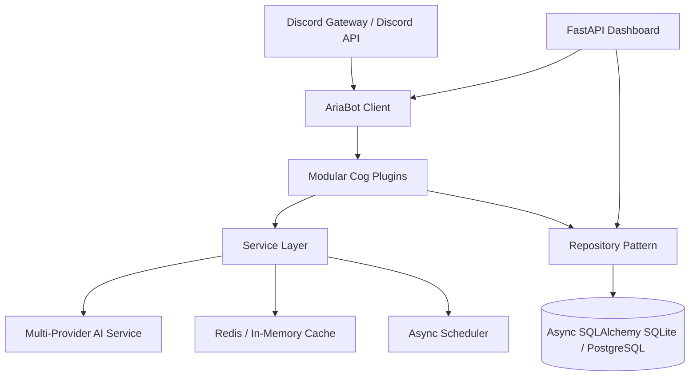

# 🏗️ Aria Technical Architecture

Aria is designed around **Clean Architecture**, **SOLID principles**, and an asynchronous service layer to ensure production stability, high throughput, and effortless extensibility.

---

## 📐 Architecture Layers

---

## 🔑 Core Architecture Pillars

1. **Modular Cog Architecture**:
   - Every major system (AI, Moderation, Tickets, Leveling, Economy, Welcome, etc.) is implemented as an isolated, independently loadable/unloadable Discord Cog extension.
   - Dynamic plugin management via `/reload` command without stopping the process.

2. **Async Repository Pattern**:
   - Database queries are abstracted behind type-safe repositories (`GuildRepository`, `ModerationRepository`, `TicketRepository`, `LevelingRepository`, `EconomyRepository`).
   - Powered by SQLAlchemy 2.0 AsyncSession for zero-blocking database access.

3. **Multi-Provider AI Architecture**:
   - Unified interface supporting OpenAI, Anthropic Claude, Google Gemini, Groq, OpenRouter, and local instances (Ollama & LM Studio).
   - Dynamic context memory tracking per user and channel.

4. **Web Dashboard & REST API**:
   - Built on FastAPI with async Uvicorn worker threads.
   - Real-time statistics, settings manager, and live log stream.
