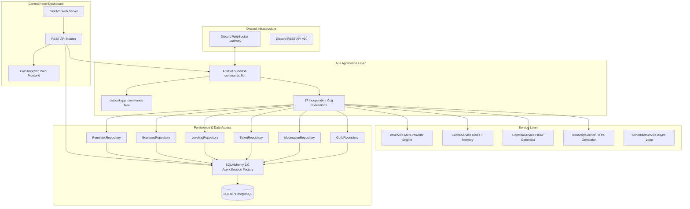

# 🏗️ Aria Technical Architecture Specification

Aria is built according to **Clean Architecture**, **SOLID Principles**, and an asynchronous event-driven model to ensure high throughput, zero-downtime plugin hot-reloading, and long-term maintainability for servers with over 100,000 members.

---

## 📐 System Component Diagram

---

## 🏛️ Layer Responsibilities

### 1. Application Layer (`bot/client.py`, `bot/main.py`)
- **`AriaBot`**: Subclasses `discord.ext.commands.Bot`. Responsible for handling ready events, loading initial extensions, setting custom bot activities, and registering the global slash command error handler.
- **Plugin Management**: Implements dynamic extension loading (`load_extension`, `unload_extension`, `reload_extension`) enabling hot-reloading without stopping the bot process.

### 2. Cog Layer (`bot/cogs/`)
- Contains 17 modular, self-contained feature cogs.
- Each cog contains slash command definitions (`@app_commands.command`), listeners (`@commands.Cog.listener`), and permission decorators (`@app_commands.checks.has_permissions`).

### 3. Service Layer (`bot/services/`)
- **`AIService`**: Unified multi-provider abstraction supporting OpenAI, Anthropic, Gemini, Groq, OpenRouter, Ollama, and LM Studio. Manages streaming generators (`AsyncGenerator[str, None]`), context window truncation, domain auto-detection, and token tracking.
- **`CacheService`**: Provides standard `get`, `set`, `delete` cache interface with automatic TTL. Connects to Redis if available, or seamlessly falls back to an in-memory dictionary.
- **`CaptchaService`**: Uses Pillow (PIL) to dynamically generate distorted alphanumeric security captchas with noise lines and Gaussian blur.
- **`TranscriptService`**: Compiles Discord channel history into formatted, self-contained HTML transcript files with styling and badges.
- **`SchedulerService`**: Runs a background asyncio loop polling due reminders, cleaning expired temp mutes, and triggering scheduled community tasks.

### 4. Repository Layer (`bot/database/repositories/`)
- Implements the **Repository Pattern** to abstract database access.
- Inherits from `BaseRepository[ModelType]` to provide generic async CRUD operations (`get`, `get_all`, `create`, `update`, `delete`).

### 5. Persistence Layer (`bot/database/`)
- **ORM Models**: Defined using SQLAlchemy 2.0 `DeclarativeBase` with mapped column types (`Mapped[int]`, `Mapped[str]`).
- **Connection**: `connection.py` configures `create_async_engine` and `async_sessionmaker` (`AsyncSessionLocal`) supporting SQLite (`aiosqlite`) for dev and PostgreSQL (`asyncpg`) for production.

---

## 🔒 Security & Exception Handling Design

1. **Permission Validation**:
   - Commands strictly enforce permission requirements via Discord API checks (`@app_commands.checks.has_permissions`) and custom predicates (`is_owner()`).

2. **Global Slash Command Error Handler**:
   - `on_tree_error` intercepts app command exceptions and returns structured, ephemeral error embeds (`MissingPermissions`, `CommandOnCooldown`).

3. **Data Sanitization**:
   - User inputs rendered in HTML transcripts are HTML-escaped using `html.escape` to prevent Cross-Site Scripting (XSS).
   - SQL queries are executed via SQLAlchemy parameter binding to prevent SQL injection.
