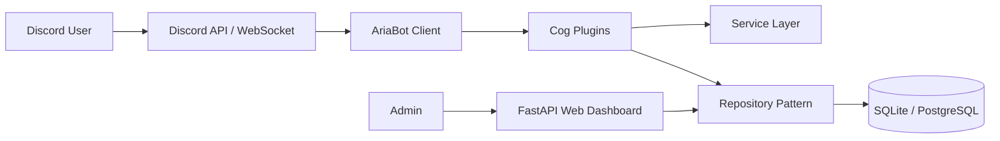

# 📄 Aria — Usage Guide, PRD & TRD

This document provides a comprehensive operational overview of **Aria**, including its functional capabilities, Product Requirements Document (PRD), and Technical Requirements Document (TRD).

---

## 🎯 What Aria Will Do (Operational Overview)

Aria is the official AI-powered Discord assistant for the **OpenDroid Community**. It transforms server management from fragmented bot commands into an integrated, enterprise-grade community operations platform.

### Core Capabilities:
1. **AI Engineering & Writing Assistant**:
   - Responds to code debugging requests, syntax fixes, code reviews, and mathematical calculations using multi-provider models (OpenAI, Anthropic Claude, Gemini, Groq, local Ollama).
   - Auto-detects query domains (Programming, Math, Troubleshooting, Writing) to adapt response formatting.
   - Retains multi-turn conversation memory per user and channel.

2. **Autonomous Moderation & AutoMod**:
   - Continuously scans incoming messages for Discord invite links, mass mentions, blocked words, and spam patterns.
   - Enforces a formal multi-tiered penalty hierarchy: Warnings -> Timeouts -> Softbans -> Permanent Bans.
   - Tracks every moderation action as an immutable Case ID record.

3. **Secure Onboarding & Verification**:
   - Protects the server against alt accounts and raid bots using dynamic Pillow-generated image Captchas.
   - Sends customized welcome embeds, auto-assigns introductory roles, and sends welcome DMs.

4. **Support Ticket Desk**:
   - Enables members to open private support channels across customizable categories.
   - Allows staff to claim tickets, add/remove members, and generate self-contained HTML transcript files upon ticket closure.

5. **Community Engagement & Gamification**:
   - **Gamification**: Grants message XP, tracks voice channel activity, updates levels, displays rank cards, and maintains server leaderboards.
   - **Economy**: Provides daily coin rewards with streak multipliers, wallet/bank balances, and coin flip mini-games.
   - **Suggestions & Polls**: Interactive button-based voting with live percentages and staff status updates.

6. **Web Management Dashboard**:
   - Allows server administrators to tweak bot prefix, toggle feature modules, configure AI providers, and view live system logs via a dark glassmorphic web dashboard.

---

## 📋 Product Requirements Document (PRD)

### 1. Product Vision & Objectives
- **Vision**: Create a single, self-hostable, production-ready AI Discord bot that replaces 5+ single-purpose bots (Carl-bot, MEE6, Ticket Tool, Dyno) while delivering state-of-the-art AI assistance.
- **Objectives**:
  - Achieve 99.9% uptime with sub-100ms response latency for standard commands.
  - Provide multi-provider AI options to eliminate vendor lock-in.
  - Enable non-technical staff to manage server settings via a web interface.

### 2. Target Audience
- Developers and members of the OpenDroid Discord Community.
- Discord Server Administrators, Moderators, and Support Engineers.

### 3. User Stories
- **As a Developer**, I want to use `/debug` or `/review` on my code snippets inside Discord so that I can resolve errors quickly without leaving chat.
- **As a Moderator**, I want automated anti-invite link enforcement and recorded Case IDs so that community rules are enforced transparently.
- **As a Community Member**, I want to earn XP and coins for participating in chats so that active contributions are rewarded.
- **As a Support Engineer**, I want HTML transcripts of closed tickets so that support interactions are archived for audit purposes.

### 4. Acceptance Criteria
- All slash commands must respond within 3 seconds or defer gracefully.
- The AI service must stream chunks or send paginated responses for text exceeding 2,000 characters.
- Verification Captchas must expire and require correct alphanumeric input before role assignment.
- System logs must rotate automatically without exhausting host storage.

---

## ⚙️ Technical Requirements Document (TRD)

### 1. Technology Stack
- **Language**: Python 3.12+
- **Discord Framework**: `discord.py` 2.7+ (Slash commands & UI components)
- **Web Dashboard**: `FastAPI` (REST API & WebSockets), `Uvicorn` ASGI server
- **Database Layer**: `SQLAlchemy 2.0` (Async Engine), `aiosqlite` (SQLite dev), `asyncpg` (PostgreSQL prod)
- **Caching Layer**: `Redis 7` (with in-memory dictionary fallback)
- **AI Integrations**: `aiohttp` HTTP client communicating with OpenAI, Anthropic, Gemini, Groq, OpenRouter, and Ollama APIs.
- **Image Generation**: `Pillow` (PIL) for captcha creation.
- **Testing & Quality**: `pytest`, `pytest-asyncio`, `ruff`, `black`, `mypy`.

### 2. Architecture & Design Patterns
- **Modular Cog Architecture**: Independent feature extensions subclassing `commands.Cog`.
- **Repository Pattern**: Data access abstraction isolating raw SQL queries from command logic.
- **Service Layer**: Decoupled services (`AIService`, `CacheService`, `CaptchaService`, `TranscriptService`, `SchedulerService`).

### 3. Data Schema Specifications
- **`guild_configs`**: Stores prefix, module toggles, channel IDs, role IDs, automod parameters, and default AI settings per guild.
- **`moderation_cases`**: Stores `case_number`, `user_id`, `moderator_id`, `action`, `reason`, `duration_seconds`, and timestamp.
- **`tickets`**: Stores `ticket_id_str`, `guild_id`, `user_id`, `channel_id`, `category`, `status`, `claimed_by`, and `transcript_url`.
- **`level_users`**: Stores `guild_id`, `user_id`, `xp`, `level`, `voice_seconds`, and `prestige`.
- **`economy_users`**: Stores `wallet`, `bank`, `daily_streak`, `last_daily`, `inventory`, and `badges`.

### 4. Non-Functional Requirements (NFRs)
- **Scalability**: Capable of handling servers with 100,000+ members via async task loops.
- **Security**: Environment variables for tokens, parameterized SQL queries to prevent injection, role-hierarchy permission checks.
- **Reliability**: Self-healing background reconnect loops and fallback in-memory caching.
